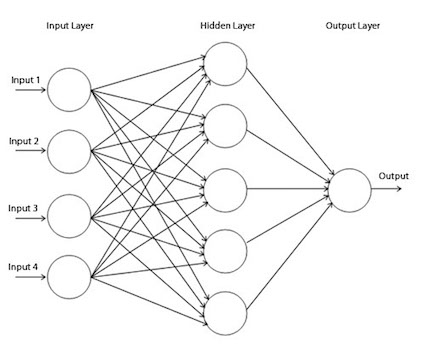
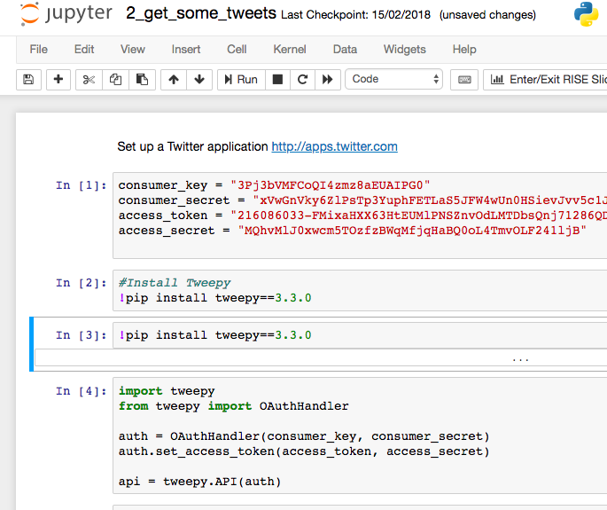
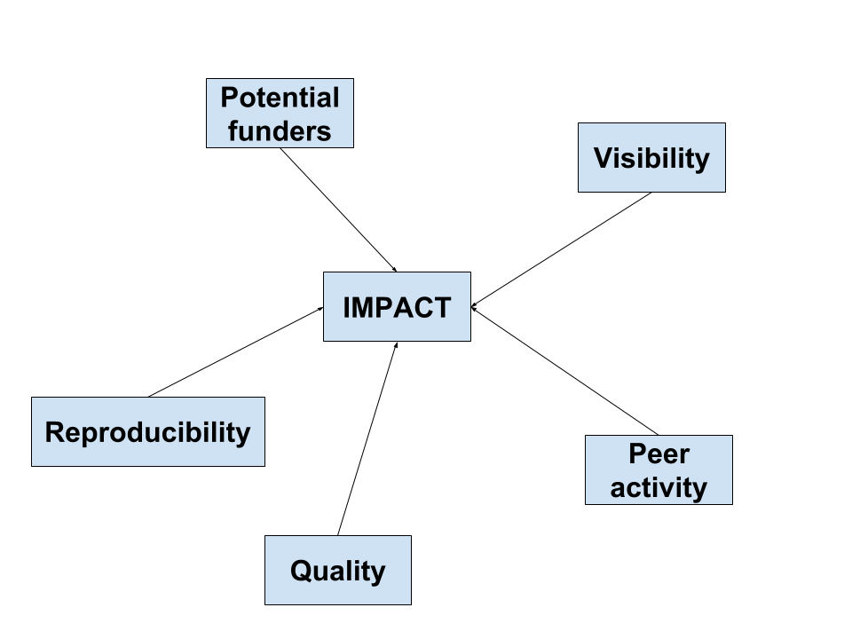
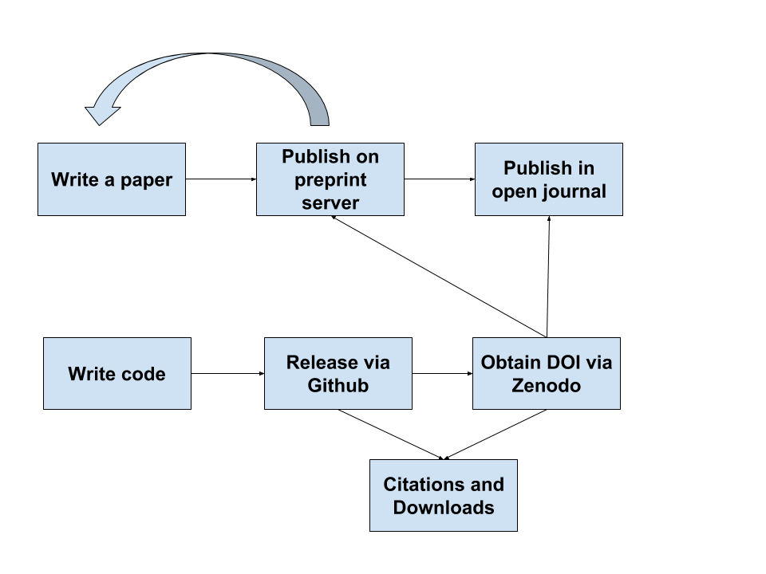

```{r setup, include=FALSE}
knitr::opts_chunk$set(echo = FALSE)
```

## 1. About me: Martin Callaghan
* Part-time PhD at SHU
    + Deep Learning for text summarisation
\newline
* Research Computing Consultant at University of Leeds
    + High Performance Computing
    + Work with researchers to design, develop and optimise computational solutions to their research questions


## 2. My research
* Deep Learning to summarise collections of documents
    + focus on academic papers
    + structure and document format
    + information classification problem
\newline
* Full workflow involves a number of tools and languages
    + Python and R
    + Deep Learning frameworks: Keras and Tensorflow
    + Graph networks to store semantic structure
    + GPUs for high performance computation
    
## 3. Potential and impact of research

* Enormous volumes of new information are published daily
* Beyond the capacity of a single human expert to absorb this
* Goal is the creation of salient digests of *document collections*
    + directing human reader to the most appropriate documents
    + providing summaries of state of knowledge to new readers
\newline
* Although there is much research in the field, there are gaps:
    + Multi-document summarisation
    + Semantic mapping across documents
    + Analysing change in a knowledge domain over time

## 4. Deep Learning
*'Deep learning allows computational models that are composed of multiple processing layers to learn representations of data with multiple levels of abstraction.
...Deep learning discovers intricate structure in large data sets by using the backpropagation algorithm to indicate how a machine should change its internal parameters that are used to compute the representation in each layer from the representation in the previous layer.'*\newline\newline

**LeCun, Bengio & Hinton (2015)**

## 4a. Deep Learning
Based on the concept of the **perceptron** (a computational analogue of a brain neuron) (Rosenblatt, 1958) and building these into multi-layered **neural networks**.

```{r, fig.align="center",out.width = "200px"}

```


## 4b. Deep Learning
* Modern Deep Learning research essentially involves manipulation of large matrices.
* Facilitated by:
    + Software frameworks (eg. Tensorflow from Google)
    + eg. Tensor of order 2 is a 2d matrix
    + Cheap computation (eg. GPU cards from NVIDIA)
* Deep Learning finding many applications in research:
    + Natural language processing (summarisation, translation)
    + Image analysis (eg. medical diagnostics)
    


## 5. Research output
***Applied research**: implementing new methodogies using currently available tools*\newline

- Deep Learning networks (written in Python)
- Graph construction and navigation (written in Python)
- Some data analysis (code written in R)\newline\newline

**Lots of writing, lots of code**

## 6. Research Software Engineering
*'Software is fundamental to research. From the humanities to physics, biology to archaeology, software plays a vital role in generating results. Not all researchers can become skilled software engineers, so a new role has developed in academia: the Research Software Engineer (RSE).'*\newline\newline
**Research Software Engineers Association (2017)**


## 7a. Literate Programming and Open Science
*'Literate programming is a programming paradigm in which a program is given as an explanation of the program logic in a natural language, such as English, interspersed with snippets of macros and traditional source code, from which a compilable source code can be generated'*\newline
Knuth (1992)

## 7b. Literate Programming and Open Science
Tools such as Jupyter Notebooks facilitate literate and open programming (sharability, reproducibility):

```{r, fig.align="center",out.width = "240px"}

```

## 8. Good practice and code discoverability

- Use version control systems (eg. [Git](https://git-scm.com/))
- Publishing code in repositories (eg. [Github](https://github.com/) and [Gitlab](https://about.gitlab.com/))
- Licencing [code](https://choosealicense.com/) and [documentation](https://creativecommons.org/)
- Provide tests, installation and usage instructions
- Release versions of code for publications
- Obtaining DOI and citing code in own publications (eg. [Zenodo](https://zenodo.org/))\newline\newline

**Tashchuk and Wilson (2017)**


## 9. Driving impact and discoverability
```{r, fig.align="center",out.width = "240px"}

```

## 10. Is research code valued?
Funding councils seem to think so. **EPSRC(2017)**
```{r, fig.align="center",out.width = "170px"}
knitr::include_graphics("images/pathways.png")
```


## 11. Final thoughts
**Potential Workflow**
```{r, fig.align="center",out.width = "260px"}

```
## References:
See Github repository:
\newline
https://github.com/callaghanmt/impact_100518

